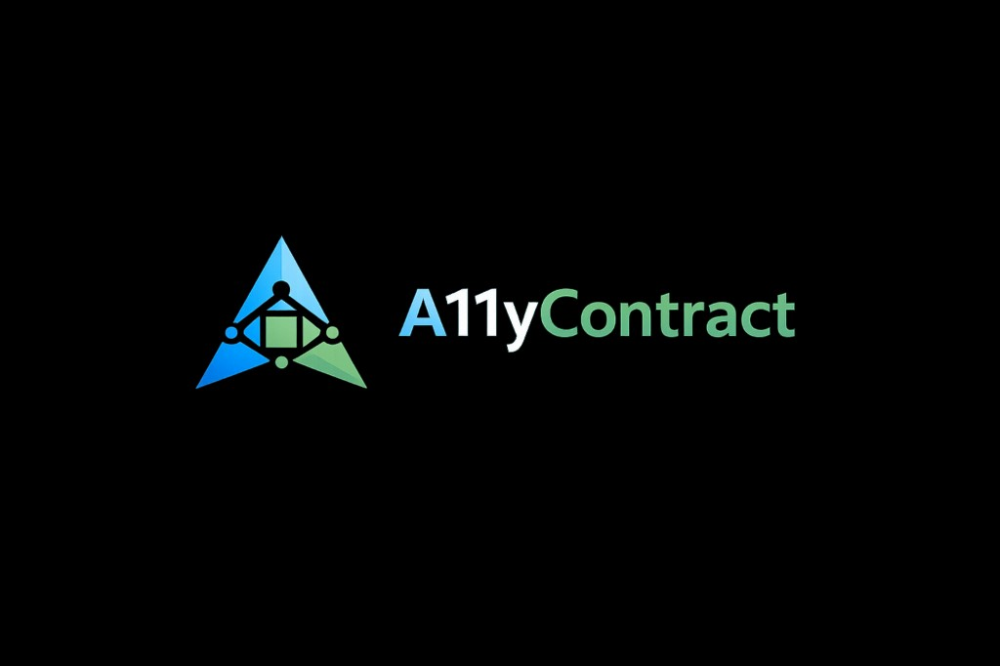

  

# A11yContractKit

**A11yContractKit is not a magic WCAG compliance tool.**

It is a developer-first accessibility contract layer for iOS apps. It helps mobile teams define, validate, report, and track accessibility requirements directly from components, tests, and CI pipelines.

> A11yContractKit does not promise automatic WCAG compliance.
>
> The goal is to turn accessibility into verifiable component contracts with traceable reports for PRs, QA, Sonar, and CI.

## What it is

A11yContractKit helps teams detect, document, and prevent common mobile accessibility issues aligned with WCAG principles. It does not replace manual accessibility testing, assistive technology testing, or formal compliance audits.

## Get started

| Resource | Description |
|----------|-------------|
| [Installation (README)](https://github.com/giovaninb/a11y-contract-kit#installation-spm) | Add via Swift Package Manager |
| [A11yContractDemo](DEMO_APP.md) | Interactive demo app |
| [Component Contracts](COMPONENT_CONTRACTS.md) | How to declare contracts |
| [Design Handoff](DESIGN_HANDOFF.md) | Design → dev checklist |

## Guides

- [WCAG Mapping](WCAG_MAPPING.md) — rules ↔ WCAG criteria
- [Sonar Integration](SONAR_INTEGRATION.md) — SonarQube reports
- [CI Integration](CI_INTEGRATION.md) — GitHub Actions and Azure DevOps

## Modules

| Module | Description |
|--------|-------------|
| `A11yContractCore` | Models, rule engine, contrast, baseline |
| `A11yContractUIKit` | UIView extensions, scanner, fluent API |
| `A11yContractSwiftUI` | Modifier + registry |
| `A11yContractReporter` | Markdown, JSON, Sonar, SARIF, JUnit |
| `A11yContractTesting` | A11yAudit + XCTest helpers |
| `A11yContractCLI` | `a11y-contract` command-line tool |

## Limitations

- Does not guarantee WCAG 2.1 AA compliance
- Contrast checks depend on extractable runtime colors
- SwiftUI uses modifiers + registry (no deep view introspection)
- CLI runs audits via XCTest (runtime)

## KMP roadmap

Planned: Kotlin Multiplatform module with `commonMain`, Compose adapters (Android), and iOS bridge.
